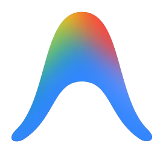

# Olá, eu sou Lucas Sales 👋

🎓 Estudante de Análise e Desenvolvimento de Sistemas (ADS)

💻 Atualmente estudando:

* HTML 5
* CSS 3
* JavaScript
* Python
* Flask
* SQLite
* Visual Studio Code
* Google AI (Antigravity)

🚀 Construindo projetos para desenvolver minhas habilidades e criar um portfólio sólido.

📚 Sempre aprendendo novas tecnologias e boas práticas de desenvolvimento.

---
### 🚀 Tecnologias

  
  
  
  
  
  
  
  
  

---

### 📫 Contato

  

  

  

---

### 📈 GitHub Stats

